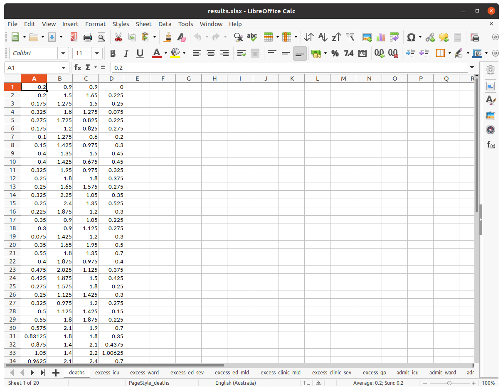

# Patient Pathways Through a Pandemic

This [MLHub](https://mlhub.ai) package uses the patientpaths package for
modelling patient pathways through a health care system, particularly
during a pandemic.

The patientpaths package is available from
<https://github.com/anu-act-health-covid19-support/patientpaths>.

This MLHub package source code is available from
<https://github.com/gjwgit/patientpaths>.


## Quick Start

```console
$ ml demo patientpaths
```

## Usage

- To install mlhub (Ubuntu):

		$ pip3 install mlhub
		$ ml configure

- To install, configure, and run the demo:

		$ ml install   gjwgit/patientpaths
		$ ml configure patientpaths
		$ ml readme    patientpaths
		$ ml commands  patientpaths
		$ ml demo      patientpaths
		
- Command line tools:

  TBD

## Command Line Tools

TBD

## Demonstration

```console
================
Patient Pathways
================

Runs a model of care algorithm to identify outcomes from a configured
health  care system. The input to the model consists of N cohorts
(e.g., age groups,  gender, socio-economic, etc.). What the cohort is
does not really matter.

For each cohort the daily presentations of patients in that cohort
(i.e., the number of patients arriving each day to the health
facility)  is provided as input. These are split into mild and severe
cases.

The other set of inputs are the proportion of the population in the
ACT jurisdiction (2%), the number of beds in ICU (22),  the number of
beds in wards (448), the number of beds in the emergency department
(202), and the total number of GPs (2,607).

Thus a spreadsheet of daily presentations is loaded in this demo,
having two tabs, one for the mild presentations and another for the
severe presentations. Each column corresponds to a cohort and each row
is a successive day.

From the dataset we see there are 4 cohorts and presentations are
provided for 36 days (that's 288 numbers).

Each cohort is also identified as at risk or not. For this example
cohorts 2 and 3 are considered at risk.

Press Enter to continue: 

=============
Model of Care
=============

The model of care is run to calculate the outcomes. The outcomes are
reported for: deaths, excess_icu, excess_ward, excess_ed_sev,
excess_ed_mld, excess_clinic_mld, excess_clinic_sev, excess_gp,
admit_icu, admit_ward, admit_ed_sev, admit_ed_mld, admit_clinic_sev,
admit_clinic_mld, admit_gp, avail_ed, avail_clinic, avail_gp,
avail_icu, and avail_ward.

The first set of outcomes reports the expected DEATHS per day per
cohort.

  1	  2	  3	  4   TOTAL
-----------------------------------
0.2	0.9	0.9	0.0	2.0
0.2	1.5	1.6	0.2	3.6
0.2	1.3	1.5	0.2	3.2
0.3	1.8	1.3	0.1	3.5
0.3	1.7	0.8	0.2	3.1
0.2	1.2	0.8	0.3	2.5
0.1	1.3	0.6	0.2	2.2
0.2	1.4	1.0	0.3	2.9
0.4	1.3	1.5	0.4	3.7
0.4	1.4	0.7	0.4	3.0
0.3	2.0	1.0	0.3	3.6
0.2	1.8	1.8	0.4	4.2
0.2	1.6	1.6	0.3	3.7
0.3	2.2	1.0	0.4	4.0
0.2	2.4	1.3	0.5	4.5
0.2	1.9	1.2	0.3	3.6
0.4	0.9	1.0	0.2	2.5
0.3	0.9	1.1	0.3	2.6
0.1	1.4	1.2	0.3	3.0
0.4	1.6	2.0	0.5	4.4
0.6	1.8	1.3	0.7	4.4
0.4	1.9	1.0	0.4	3.6
0.5	2.0	1.1	0.4	4.0
0.4	1.9	1.5	0.4	4.2
0.3	1.6	1.8	0.2	3.9
0.2	1.1	1.4	0.3	3.1
0.3	1.0	1.2	0.3	2.8
0.5	1.1	1.4	0.2	3.2
0.6	1.8	1.9	0.2	4.4
0.6	2.1	1.9	0.7	5.3
0.8	1.8	1.8	0.4	4.8
0.9	1.4	2.1	0.4	4.8
1.0	1.4	2.2	1.0	5.7
1.0	2.1	2.4	0.7	6.2
0.5	1.9	1.7	0.4	4.4
0.3	1.0	0.9	0.7	2.9
-----------------------------------

Press Enter to continue: 

=====================
Saving to Spreadsheet
=====================

The results are saved to a spreadsheet 'results.xlsx' with a tab for
each of the measures calculated.
```


